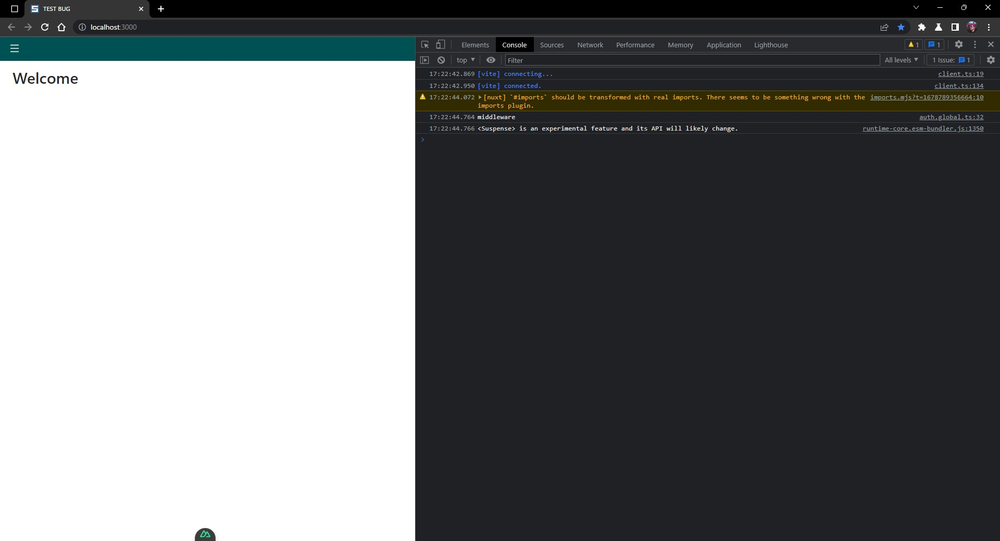
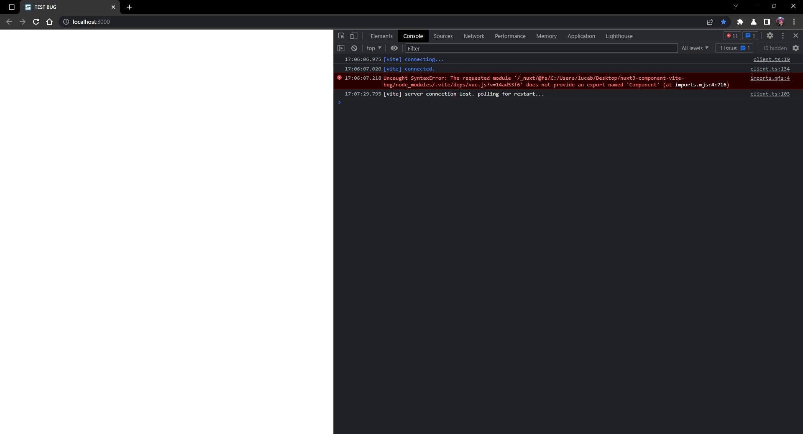

# Nuxt 3 Minimal Starter

Look at the [nuxt 3 documentation](https://v3.nuxtjs.org) to learn more.

## Setup

Make sure to install the dependencies:

```bash
    yarn install
```

Configure Environment for development

```bash
    cp ./env/.env.development ./src/.env
```

## Development Server

Start the development server on [localhost](http://localhost:3000)

```bash
    yarn dev
```

## Production

Build the application for production:

```bash
    yarn build
```

Locally preview production build:

```bash
    yarn preview
```

## Workflow

1 `git flow feature start {JIRA-N-nome-branch}`;
2 Develop the feature;
3 Open a [Pull request](https://dev.azure.com/illimitybank/abilio/_git/frontend-backoffice-abilio/pullrequestcreate?sourceRef=&targetRef=develop&sourceRepositoryId=f6c767ad-7bd8-4023-915f-d60dff9a31ad&targetRepositoryId=f6c767ad-7bd8-4023-915f-d60dff9a31ad);
4 Wait for PR approval;
5 `git flow feature finish {JIRA-N-nome-branch}`.

First time you setup git flow launch `git flow init`, for the first question type: **main** as the release branch, for the version tag prefix question type: **v**, then leaves all the rest as default.

Checkout the [deployment documentation](https://v3.nuxtjs.org/guide/deploy/presets) for more information.

### Typescript

[Vue Js Docs](https://vuejs.org/guide/typescript/overview.html#takeover-mode)

## Git Flow

[Git flow](https://www.atlassian.com/git/tutorials/comparing-workflows/gitflow-workflow)

______________

## BUG Reproduction

Step to reproduce:

- Install the project `yarn install`, with nuxt@3.1.2 `yarn add --exact nuxt@3.1.2`;
- Run `yarn dev` (everything is working);
- Upgrade nuxt `npx nuxi upgrade --force` (**to version 3.2.3**);
- Run `yarn dev`, the page appear blank (*"Requested module 'nuxt/@fs/C:/Users/luxdamore/Desktop/nuxt3-component-vite-bug/node_modules/.vite/deps/vue.js?v=14ad53f6' does not provide an export named 'Component'"* error appear in the browser console).

## BUG Images

- Nuxt Version 3.1.2:



- Nuxt Version ^3.2.3:


